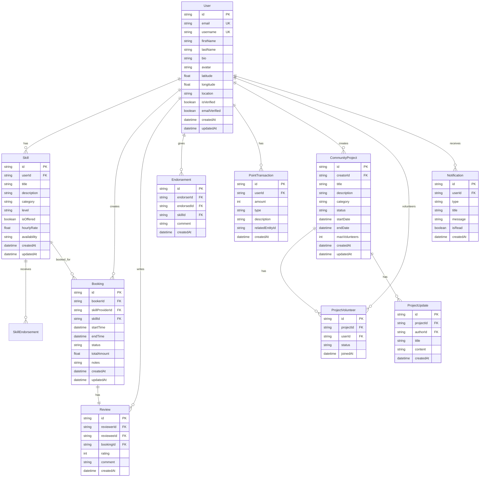

# SkillSwap - Technical Documentation

## 🏗️ System Architecture

### High-Level Architecture

```
┌─────────────────────────────────────────────────────────────────┐
│                        Frontend Layer                           │
├─────────────────────────────────────────────────────────────────┤
│  Next.js 15 App Router                                          │
│  ├── React Server Components                                    │
│  ├── Client Components                                          │
│  ├── TypeScript 5                                               │
│  └── Tailwind CSS + shadcn/ui                                   │
└─────────────────────────────────────────────────────────────────┘
                                    │
                                    ▼
┌─────────────────────────────────────────────────────────────────┐
│                        API Layer                                │
├─────────────────────────────────────────────────────────────────┤
│  Next.js API Routes                                             │
│  ├── RESTful Endpoints                                          │
│  ├── Authentication Middleware                                  │
│  ├── Validation & Error Handling                                │
│  └── File Upload Handling                                       │
└─────────────────────────────────────────────────────────────────┘
                                    │
                                    ▼
┌─────────────────────────────────────────────────────────────────┐
│                      Business Logic Layer                       │
├─────────────────────────────────────────────────────────────────┤
│  ├── Authentication Service                                     │
│  ├── Geolocation Service                                        │
│  ├── Booking & Scheduling Service                               │
│  ├── Reputation System Service                                  │
│  ├── Community Projects Service                                 │
│  ├── Gamification Service                                       │
│  └── Accessibility Service                                      │
└─────────────────────────────────────────────────────────────────┘
                                    │
                                    ▼
┌─────────────────────────────────────────────────────────────────┐
│                       Data Layer                                │
├─────────────────────────────────────────────────────────────────┤
│  Prisma ORM                                                     │
│  ├── Query Builder                                              │
│  ├── Database Migrations                                        │
│  ├── Data Validation                                            │
│  └── Connection Pooling                                         │
│  └── SQLite Database                                            │
└─────────────────────────────────────────────────────────────────┘
```

### Component Architecture

#### Frontend Components Structure
```
src/
├── app/
│   ├── (auth)/
│   │   ├── login/
│   │   └── register/
│   ├── dashboard/
│   ├── skills/
│   ├── map/
│   ├── bookings/
│   ├── community/
│   └── profile/
├── components/
│   ├── ui/                    # shadcn/ui components
│   ├── forms/                 # Form components
│   ├── maps/                  # Map components
│   ├── charts/                # Data visualization
│   └── layout/                # Layout components
└── lib/
    ├── auth.ts               # Authentication logic
    ├── db.ts                 # Database connection
    ├── utils.ts              # Utility functions
    └── validations.ts        # Form validations
```

#### Backend Services Structure
```
src/app/api/
├── auth/
│   ├── login/
│   ├── register/
│   └── verify/
├── skills/
│   ├── route.ts
│   ├── [id]/
│   └── search/
├── users/
│   ├── route.ts
│   ├── [id]/
│   └── profile/
├── bookings/
│   ├── route.ts
│   ├── [id]/
│   └── availability/
├── community/
│   ├── projects/
│   └── volunteers/
├── gamification/
│   ├── points/
│   ├── rewards/
│   └── transactions/
└── notifications/
    ├── route.ts
    └── push/
```

## 🗄️ Database Schema

### Entity Relationship Diagram



### Prisma Schema

```prisma
// This is your Prisma schema file
generator client {
  provider = "prisma-client-js"
}

datasource db {
  provider = "sqlite"
  url      = env("DATABASE_URL")
}

model User {
  id            String    @id @default(cuid())
  email         String    @unique
  username      String    @unique
  firstName     String
  lastName      String
  bio           String?
  avatar        String?
  latitude      Float?
  longitude     Float?
  location      String?
  isVerified    Boolean   @default(false)
  emailVerified Boolean   @default(false)
  createdAt     DateTime  @default(now())
  updatedAt     DateTime  @updatedAt

  // Relations
  skills              Skill[]
  bookingsCreated     Booking[]         @relation("BookingsCreated")
  bookingsReceived    Booking[]         @relation("BookingsReceived")
  reviewsGiven        Review[]          @relation("ReviewsGiven")
  reviewsReceived     Review[]          @relation("ReviewsReceived")
  endorsementsGiven   Endorsement[]     @relation("EndorsementsGiven")
  endorsementsReceived Endorsement[]    @relation("EndorsementsReceived")
  pointTransactions   PointTransaction[]
  projectsCreated     CommunityProject[]
  projectVolunteers   ProjectVolunteer[]
  notifications       Notification[]

  @@map("users")
}

model Skill {
  id           String   @id @default(cuid())
  userId       String
  title        String
  description  String
  category     String
  level        String
  isOffered    Boolean
  hourlyRate   Float?
  availability String?
  createdAt    DateTime @default(now())
  updatedAt    DateTime @updatedAt

  // Relations
  user         User              @relation(fields: [userId], references: [id], onDelete: Cascade)
  bookings     Booking[]
  endorsements SkillEndorsement[]

  @@map("skills")
}

model Booking {
  id               String   @id @default(cuid())
  bookerId         String
  skillProviderId  String
  skillId          String
  startTime        DateTime
  endTime          DateTime
  status           String
  totalAmount      Float?
  notes            String?
  createdAt        DateTime @default(now())
  updatedAt        DateTime @updatedAt

  // Relations
  booker        User    @relation("BookingsCreated", fields: [bookerId], references: [id])
  skillProvider User    @relation("BookingsReceived", fields: [skillProviderId], references: [id])
  skill         Skill   @relation(fields: [skillId], references: [id])
  review        Review?

  @@map("bookings")
}

model Review {
  id         String   @id @default(cuid())
  reviewerId String
  revieweeId String
  bookingId  String   @unique
  rating     Int
  comment    String?
  createdAt  DateTime @default(now())

  // Relations
  reviewer User    @relation("ReviewsGiven", fields: [reviewerId], references: [id])
  reviewee User    @relation("ReviewsReceived", fields: [revieweeId], references: [id])
  booking  Booking @relation(fields: [bookingId], references: [id], onDelete: Cascade)

  @@map("reviews")
}

model Endorsement {
  id          String   @id @default(cuid())
  endorserId  String
  endorsedId  String
  skillId     String
  comment     String?
  createdAt   DateTime @default(now())

  // Relations
  endorser  User              @relation("EndorsementsGiven", fields: [endorserId], references: [id])
  endorsed  User              @relation("EndorsementsReceived", fields: [endorsedId], references: [id])
  skill     Skill             @relation(fields: [skillId], references: [id], onDelete: Cascade)

  @@map("endorsements")
}

model SkillEndorsement {
  id           String @id @default(cuid())
  endorsementId String
  skillId      String

  // Relations
  endorsement Endorsement @relation(fields: [endorsementId], references: [id], onDelete: Cascade)
  skill       Skill       @relation(fields: [skillId], references: [id], onDelete: Cascade)

  @@map("skill_endorsements")
}

model PointTransaction {
  id              String   @id @default(cuid())
  userId          String
  amount          Int
  type            String
  description     String
  relatedEntityId String?
  createdAt       DateTime @default(now())

  // Relations
  user User @relation(fields: [userId], references: [id], onDelete: Cascade)

  @@map("point_transactions")
}

model CommunityProject {
  id            String   @id @default(cuid())
  creatorId     String
  title         String
  description   String
  category      String
  status        String
  startDate     DateTime
  endDate       DateTime
  maxVolunteers Int?
  createdAt     DateTime @default(now())
  updatedAt     DateTime @updatedAt

  // Relations
  creator  User               @relation(fields: [creatorId], references: [id])
  volunteers ProjectVolunteer[]
  updates   ProjectUpdate[]

  @@map("community_projects")
}

model ProjectVolunteer {
  id        String   @id @default(cuid())
  projectId String
  userId    String
  status    String
  joinedAt  DateTime @default(now())

  // Relations
  project CommunityProject @relation(fields: [projectId], references: [id], onDelete: Cascade)
  user    User             @relation(fields: [userId], references: [id], onDelete: Cascade)

  @@unique([projectId, userId])
  @@map("project_volunteers")
}

model ProjectUpdate {
  id        String   @id @default(cuid())
  projectId String
  authorId  String
  title     String
  content   String
  createdAt DateTime @default(now())

  // Relations
  project CommunityProject @relation(fields: [projectId], references: [id], onDelete: Cascade)

  @@map("project_updates")
}

model Notification {
  id        String   @id @default(cuid())
  userId    String
  type      String
  title     String
  message   String
  isRead    Boolean  @default(false)
  createdAt DateTime @default(now())

  // Relations
  user User @relation(fields: [userId], references: [id], onDelete: Cascade)

  @@map("notifications")
}
```

## 🔌 API Endpoints

### Authentication Endpoints

#### POST /api/auth/register
Register a new user account.

**Request Body:**
```json
{
  "email": "user@example.com",
  "username": "username",
  "firstName": "John",
  "lastName": "Doe",
  "password": "password123"
}
```

**Response:**
```json
{
  "success": true,
  "data": {
    "user": {
      "id": "user_id",
      "email": "user@example.com",
      "username": "username",
      "firstName": "John",
      "lastName": "Doe"
    },
    "token": "jwt_token"
  }
}
```

#### POST /api/auth/login
Authenticate user and return JWT token.

**Request Body:**
```json
{
  "email": "user@example.com",
  "password": "password123"
}
```

**Response:**
```json
{
  "success": true,
  "data": {
    "user": {
      "id": "user_id",
      "email": "user@example.com",
      "username": "username"
    },
    "token": "jwt_token"
  }
}
```

#### POST /api/auth/verify
Verify email address.

**Request Body:**
```json
{
  "token": "verification_token"
}
```

**Response:**
```json
{
  "success": true,
  "message": "Email verified successfully"
}
```

### User Endpoints

#### GET /api/users
Get all users with pagination and filtering.

**Query Parameters:**
- `page`: Page number (default: 1)
- `limit`: Items per page (default: 10)
- `search`: Search term
- `location`: Filter by location
- `skills`: Filter by skills

**Response:**
```json
{
  "success": true,
  "data": {
    "users": [
      {
        "id": "user_id",
        "username": "username",
        "firstName": "John",
        "lastName": "Doe",
        "bio": "User bio",
        "avatar": "avatar_url",
        "location": "New York, NY",
        "skills": [
          {
            "id": "skill_id",
            "title": "Web Development",
            "category": "Technology",
            "level": "Advanced"
          }
        ],
        "rating": 4.5,
        "endorsements": 12
      }
    ],
    "pagination": {
      "page": 1,
      "limit": 10,
      "total": 100,
      "totalPages": 10
    }
  }
}
```

#### GET /api/users/[id]
Get user profile by ID.

**Response:**
```json
{
  "success": true,
  "data": {
    "id": "user_id",
    "username": "username",
    "firstName": "John",
    "lastName": "Doe",
    "bio": "User bio",
    "avatar": "avatar_url",
    "location": "New York, NY",
    "latitude": 40.7128,
    "longitude": -74.0060,
    "isVerified": true,
    "skills": [
      {
        "id": "skill_id",
        "title": "Web Development",
        "description": "Full-stack web development",
        "category": "Technology",
        "level": "Advanced",
        "isOffered": true,
        "hourlyRate": 50
      }
    ],
    "stats": {
      "totalBookings": 25,
      "averageRating": 4.5,
      "totalEndorsements": 12,
      "points": 1500
    }
  }
}
```

#### PUT /api/users/[id]
Update user profile.

**Request Body:**
```json
{
  "firstName": "John",
  "lastName": "Doe",
  "bio": "Updated bio",
  "location": "New York, NY",
  "latitude": 40.7128,
  "longitude": -74.0060
}
```

**Response:**
```json
{
  "success": true,
  "data": {
    "id": "user_id",
    "firstName": "John",
    "lastName": "Doe",
    "bio": "Updated bio",
    "location": "New York, NY"
  }
}
```

### Skills Endpoints

#### GET /api/skills
Get all skills with filtering.

**Query Parameters:**
- `category`: Filter by category
- `level`: Filter by level
- `location`: Filter by location
- `isOffered`: Filter by offered/seeking
- `search`: Search term

**Response:**
```json
{
  "success": true,
  "data": [
    {
      "id": "skill_id",
      "title": "Web Development",
      "description": "Full-stack web development",
      "category": "Technology",
      "level": "Advanced",
      "isOffered": true,
      "hourlyRate": 50,
      "user": {
        "id": "user_id",
        "username": "username",
        "firstName": "John",
        "lastName": "Doe",
        "avatar": "avatar_url",
        "location": "New York, NY"
      }
    }
  ]
}
```

#### POST /api/skills
Create a new skill.

**Request Body:**
```json
{
  "title": "Web Development",
  "description": "Full-stack web development",
  "category": "Technology",
  "level": "Advanced",
  "isOffered": true,
  "hourlyRate": 50,
  "availability": "Weekends"
}
```

**Response:**
```json
{
  "success": true,
  "data": {
    "id": "skill_id",
    "title": "Web Development",
    "description": "Full-stack web development",
    "category": "Technology",
    "level": "Advanced",
    "isOffered": true,
    "hourlyRate": 50,
    "availability": "Weekends",
    "userId": "user_id"
  }
}
```

#### GET /api/skills/[id]
Get skill by ID.

**Response:**
```json
{
  "success": true,
  "data": {
    "id": "skill_id",
    "title": "Web Development",
    "description": "Full-stack web development",
    "category": "Technology",
    "level": "Advanced",
    "isOffered": true,
    "hourlyRate": 50,
    "availability": "Weekends",
    "user": {
      "id": "user_id",
      "username": "username",
      "firstName": "John",
      "lastName": "Doe",
      "avatar": "avatar_url",
      "location": "New York, NY",
      "rating": 4.5
    },
    "endorsements": [
      {
        "id": "endorsement_id",
        "comment": "Excellent developer!",
        "endorser": {
          "username": "endorser_username",
          "firstName": "Jane",
          "lastName": "Smith"
        },
        "createdAt": "2024-01-15T10:30:00Z"
      }
    ]
  }
}
```

### Bookings Endpoints

#### GET /api/bookings
Get user bookings.

**Query Parameters:**
- `type`: "created" or "received"
- `status`: Filter by status
- `page`: Page number
- `limit`: Items per page

**Response:**
```json
{
  "success": true,
  "data": {
    "bookings": [
      {
        "id": "booking_id",
        "startTime": "2024-02-01T10:00:00Z",
        "endTime": "2024-02-01T12:00:00Z",
        "status": "confirmed",
        "totalAmount": 100,
        "skill": {
          "id": "skill_id",
          "title": "Web Development",
          "category": "Technology"
        },
        "booker": {
          "id": "user_id",
          "username": "username",
          "firstName": "John",
          "lastName": "Doe"
        },
        "skillProvider": {
          "id": "provider_id",
          "username": "provider",
          "firstName": "Jane",
          "lastName": "Smith"
        }
      }
    ],
    "pagination": {
      "page": 1,
      "limit": 10,
      "total": 25,
      "totalPages": 3
    }
  }
}
```

#### POST /api/bookings
Create a new booking.

**Request Body:**
```json
{
  "skillId": "skill_id",
  "skillProviderId": "provider_id",
  "startTime": "2024-02-01T10:00:00Z",
  "endTime": "2024-02-01T12:00:00Z",
  "notes": "Need help with React project"
}
```

**Response:**
```json
{
  "success": true,
  "data": {
    "id": "booking_id",
    "skillId": "skill_id",
    "skillProviderId": "provider_id",
    "startTime": "2024-02-01T10:00:00Z",
    "endTime": "2024-02-01T12:00:00Z",
    "status": "pending",
    "totalAmount": 100,
    "notes": "Need help with React project",
    "bookerId": "user_id"
  }
}
```

#### PUT /api/bookings/[id]
Update booking status.

**Request Body:**
```json
{
  "status": "confirmed",
  "notes": "Looking forward to the session"
}
```

**Response:**
```json
{
  "success": true,
  "data": {
    "id": "booking_id",
    "status": "confirmed",
    "notes": "Looking forward to the session"
  }
}
```

### Reviews Endpoints

#### POST /api/reviews
Create a new review.

**Request Body:**
```json
{
  "bookingId": "booking_id",
  "revieweeId": "user_id",
  "rating": 5,
  "comment": "Excellent session! Very knowledgeable."
}
```

**Response:**
```json
{
  "success": true,
  "data": {
    "id": "review_id",
    "bookingId": "booking_id",
    "revieweeId": "user_id",
    "rating": 5,
    "comment": "Excellent session! Very knowledgeable.",
    "reviewerId": "current_user_id",
    "createdAt": "2024-02-01T12:30:00Z"
  }
}
```

#### GET /api/reviews/[userId]
Get reviews for a user.

**Response:**
```json
{
  "success": true,
  "data": [
    {
      "id": "review_id",
      "rating": 5,
      "comment": "Excellent session! Very knowledgeable.",
      "reviewer": {
        "username": "reviewer_username",
        "firstName": "Alice",
        "lastName": "Johnson"
      },
      "booking": {
        "skill": {
          "title": "Web Development"
        },
        "createdAt": "2024-02-01T10:00:00Z"
      },
      "createdAt": "2024-02-01T12:30:00Z"
    }
  ]
}
```

### Community Projects Endpoints

#### GET /api/community/projects
Get all community projects.

**Query Parameters:**
- `category`: Filter by category
- `status`: Filter by status
- `location`: Filter by location
- `search`: Search term

**Response:**
```json
{
  "success": true,
  "data": [
    {
      "id": "project_id",
      "title": "Community Garden Initiative",
      "description": "Help us build a community garden",
      "category": "Environment",
      "status": "active",
      "startDate": "2024-03-01T00:00:00Z",
      "endDate": "2024-06-01T00:00:00Z",
      "maxVolunteers": 20,
      "currentVolunteers": 8,
      "creator": {
        "username": "creator_username",
        "firstName": "Bob",
        "lastName": "Wilson"
      },
      "createdAt": "2024-01-15T10:00:00Z"
    }
  ]
}
```

#### POST /api/community/projects
Create a new community project.

**Request Body:**
```json
{
  "title": "Community Garden Initiative",
  "description": "Help us build a community garden",
  "category": "Environment",
  "startDate": "2024-03-01T00:00:00Z",
  "endDate": "2024-06-01T00:00:00Z",
  "maxVolunteers": 20
}
```

**Response:**
```json
{
  "success": true,
  "data": {
    "id": "project_id",
    "title": "Community Garden Initiative",
    "description": "Help us build a community garden",
    "category": "Environment",
    "status": "active",
    "startDate": "2024-03-01T00:00:00Z",
    "endDate": "2024-06-01T00:00:00Z",
    "maxVolunteers": 20,
    "creatorId": "user_id"
  }
}
```

#### POST /api/community/projects/[id]/volunteer
Volunteer for a project.

**Response:**
```json
{
  "success": true,
  "data": {
    "id": "volunteer_id",
    "projectId": "project_id",
    "userId": "user_id",
    "status": "pending",
    "joinedAt": "2024-02-01T10:00:00Z"
  }
}
```

### Gamification Endpoints

#### GET /api/gamification/points/[userId]
Get user points and transactions.

**Response:**
```json
{
  "success": true,
  "data": {
    "totalPoints": 1500,
    "level": "Gold",
    "nextLevelPoints": 2000,
    "transactions": [
      {
        "id": "transaction_id",
        "amount": 50,
        "type": "earned",
        "description": "Completed booking: Web Development",
        "createdAt": "2024-02-01T12:00:00Z"
      }
    ]
  }
}
```

#### POST /api/gamification/points/earn
Earn points for an action.

**Request Body:**
```json
{
  "userId": "user_id",
  "amount": 50,
  "type": "booking_completed",
  "description": "Completed booking: Web Development",
  "relatedEntityId": "booking_id"
}
```

**Response:**
```json
{
  "success": true,
  "data": {
    "id": "transaction_id",
    "userId": "user_id",
    "amount": 50,
    "type": "earned",
    "description": "Completed booking: Web Development",
    "relatedEntityId": "booking_id",
    "createdAt": "2024-02-01T12:00:00Z"
  }
}
```

### Notifications Endpoints

#### GET /api/notifications
Get user notifications.

**Query Parameters:**
- `isRead`: Filter by read status
- `type`: Filter by type
- `page`: Page number
- `limit`: Items per page

**Response:**
```json
{
  "success": true,
  "data": {
    "notifications": [
      {
        "id": "notification_id",
        "type": "booking_request",
        "title": "New Booking Request",
        "message": "John Doe wants to book your Web Development skill",
        "isRead": false,
        "createdAt": "2024-02-01T10:00:00Z"
      }
    ],
    "unreadCount": 3
  }
}
```

#### PUT /api/notifications/[id]/read
Mark notification as read.

**Response:**
```json
{
  "success": true,
  "data": {
    "id": "notification_id",
    "isRead": true
  }
}
```

## 🔐 Authentication & Security

### JWT Token Structure
```json
{
  "sub": "user_id",
  "email": "user@example.com",
  "username": "username",
  "role": "user",
  "iat": 1643723400,
  "exp": 1643727000
}
```

### API Security Measures
- **JWT Authentication**: All protected routes require valid JWT token
- **Input Validation**: All inputs validated using Zod schemas
- **Rate Limiting**: API endpoints rate-limited to prevent abuse
- **CORS**: Proper CORS configuration for cross-origin requests
- **SQL Injection Prevention**: Prisma ORM prevents SQL injection attacks
- **XSS Protection**: Input sanitization and output encoding

### Error Handling
```json
{
  "success": false,
  "error": {
    "code": "VALIDATION_ERROR",
    "message": "Invalid input data",
    "details": [
      {
        "field": "email",
        "message": "Invalid email format"
      }
    ]
  }
}
```

## 📊 Performance & Scalability

### Database Optimization
- **Indexing**: Proper indexes on frequently queried fields
- **Connection Pooling**: Prisma connection pooling for performance
- **Query Optimization**: Efficient queries with proper selects and includes
- **Caching**: In-memory caching for frequently accessed data

### API Performance
- **Pagination**: All list endpoints support pagination
- **Field Selection**: Selective field loading to reduce payload size
- **Compression**: Gzip compression for API responses
- **CDN**: Static assets served via CDN

### Monitoring & Analytics
- **Error Tracking**: Comprehensive error logging and tracking
- **Performance Monitoring**: API response time monitoring
- **Usage Analytics**: Track API usage and user behavior
- **Health Checks**: Regular health checks for all services

---

This technical documentation provides a comprehensive overview of the SkillSwap platform's architecture, database schema, and API endpoints. The system is designed with scalability, security, and performance in mind, following modern web development best practices.